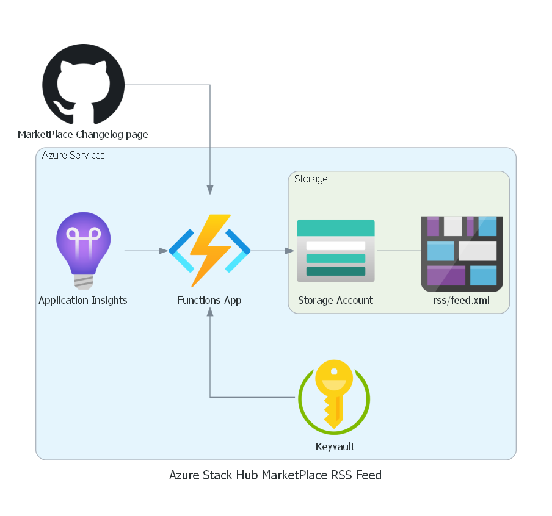

# Azure Stack Hub MarketPlace RSS Feed Generator

## Description

While Microsoft provides a [changelog](https://github.com/MicrosoftDocs/azure-stack-docs/blob/master/azure-stack/operator/azure-stack-marketplace-changes.md) of all new, updated or deprecated Marketplace items for Azure Stack Hub it's hard to get notified of these changes.

This function aims to solve this issue by generating a RSS feed of the MarketPlace items changes which can be leverage in your favorites RSS readers (Feedly, Teams, IFFT, LogicApp or other RSS compatible readers)

## Architecture

The Architecture of the solution is pretty simple:

- An Azure Function (v3 in C#) is triggered every day to check the official changelog.
- If the file was updated, it is parsed to generate a new RSS Feed.
Marketplace items changes are grouped by update/addition date and generate a new item in the feed.
- The feed is written to a publicly available Azure Blob which can be consumed by RSS readers.

Other architecture choices:
- Storage Account key and Application Insight Instrumentation key are stored securely in a Keyvault.
- Only the managed identity of the Function app has access to the Keyvault secrets
- Most configurable options are available either as ARM Template Parameter and/or Azure Functions AppSettings
- GitHub Actions are used to deploy infrastructure as code and function artifact

## Result

The RSS Feed is available on https://azhmktplacerss.blob.core.windows.net/rss/feed.xml

## Contribute

Don't hesitate to send Issues and/or Pull Requests !